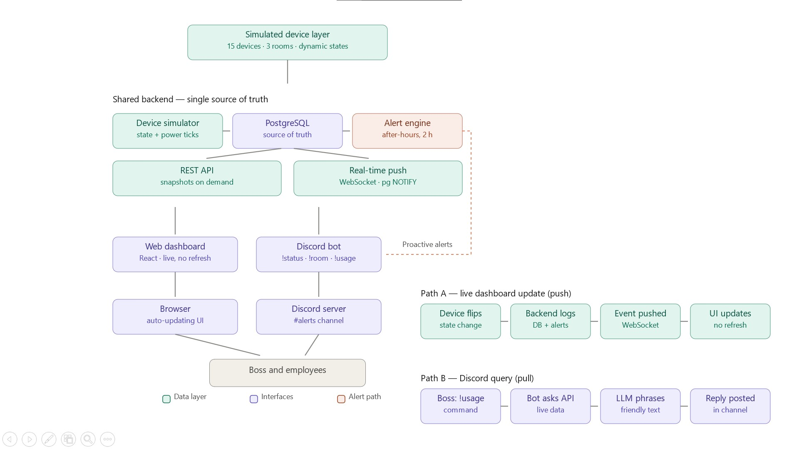

# ⚡ Smart Office Monitoring System

> A real-time Smart Office Monitoring System that enables office administrators to monitor electrical devices, visualize office energy usage, and detect unnecessary electricity consumption through an interactive web dashboard and a shared backend powering both the dashboard and a Discord bot.


---

## 📖 Project Overview

Electricity is often wasted in offices because lights and fans remain switched on after employees leave. This project provides a centralized monitoring solution that gives administrators a live overview of the office environment.

The system visualizes every monitored electrical device, tracks total power consumption, highlights abnormal situations, and presents the entire office as an interactive digital twin.

The project was developed as part of the **Techathon Preliminary Round**.

---

# ✨ Features

## 🏢 Interactive Office Floor Map

- Live top-view office layout
- Three monitored office rooms
- Interactive lights
- Animated ceiling fans
- Visual room status
- Hoverable devices with information

---

## ⚡ Real-Time Monitoring

- Live device status
- Active device count
- Total office power consumption
- Room-wise power consumption
- Office activity overview

---

## 🚨 Smart Alert System

Displays alerts for situations such as:

- Devices running outside office hours
- Rooms with prolonged continuous operation
- High power consumption

---

## 📊 Analytics Dashboard

- Live KPI cards
- Power gauge
- Room statistics
- Energy charts
- Office hour information

---

## 🎨 Modern User Experience

- Responsive layout
- Smooth animations
- Premium dashboard interface
- Clean enterprise design
- Interactive visualizations

---

# 🏢 Office Layout

The monitored office consists of:

- Drawing Room
- Work Room 1
- Work Room 2

Each room contains:

- 2 Fans
- 3 Lights

Total monitored devices:

**15 Electrical Devices**

---

# 🛠 Tech Stack

## Frontend

- React 19
- TypeScript
- TanStack Start
- TanStack Router
- Vite

## UI

- Tailwind CSS
- Radix UI
- Lucide Icons
- Recharts

## Development

- ESLint
- Prettier

---

# 📁 Project Structure

```text
src/
│
├── components/
│   ├── kernel/
│   └── ui/
│
├── contexts/
├── hooks/
├── lib/
├── routes/
├── services/
├── simulation/
├── types/
└── utils/
```

---

# ⚙️ Getting Started

## Prerequisites

- Node.js 20+
- npm / bun

---

## Installation

```bash
git clone https://github.com/your-username/your-repository.git

cd your-repository

npm install
```

or

```bash
bun install
```

---

## Start Development Server

```bash
npm run dev
```

or

```bash
bun run dev
```

---

## Production Build

```bash
npm run build
```

---

## Preview Production Build

```bash
npm run preview
```

---

# 📡 System Architecture

```
Simulated Device Layer
          │
          ▼
     Shared Backend API
      ├──────────────┐
      ▼              ▼
Web Dashboard   Discord Bot
```

Both the web dashboard and Discord bot are designed to consume the same backend data source, ensuring a single source of truth for all monitored devices.

---

# 📈 Dashboard Modules

- Interactive Floor Map
- KPI Cards
- Device Status
- Alerts Panel
- Power Gauge
- Energy Charts
- Office Hours Card
- Room Status Cards

---

# 🔄 Simulated Data

Each monitored device contains:

- Device ID
- Room
- Device Name
- Device Type
- Current Status
- Power Draw
- Runtime
- Last Updated Timestamp

The frontend currently visualizes simulated live data that can later be replaced with a shared backend API without significant UI changes.

---

# 📷 Screenshots

## Dashboard

> Add screenshot here

```
docs/screenshots/dashboard.png
```

---

## Interactive Floor Map

> Add screenshot here

```
docs/screenshots/floor-map.png
```

---

## Alerts

> Add screenshot here

```
docs/screenshots/alerts.png
```

---

# 🚀 Future Improvements

- Backend integration
- Discord Bot integration
- WebSocket support
- User authentication
- Historical analytics
- Energy prediction
- Device control
- Mobile application

---

# 👥 Team

| Name | Role |
|------|------|
| Your Name | Frontend Dashboard |
| Member 2 | Backend |
| Member 3 | Discord Bot |

---

# 📄 License

This project is released under the MIT License.

---

# 🙏 Acknowledgements

Developed as part of the Techathon Smart Office Monitoring Challenge.

Special thanks to the organizers for providing an engaging engineering problem focused on real-time systems, user experience, and software architecture.


# React + Vite

This template provides a minimal setup to get React working in Vite with HMR and some ESLint rules.

Currently, two official plugins are available:

- [@vitejs/plugin-react](https://github.com/vitejs/vite-plugin-react/blob/main/packages/plugin-react) uses [Oxc](https://oxc.rs)
- [@vitejs/plugin-react-swc](https://github.com/vitejs/vite-plugin-react/blob/main/packages/plugin-react-swc) uses [SWC](https://swc.rs/)

## React Compiler

The React Compiler is not enabled on this template because of its impact on dev & build performances. To add it, see [this documentation](https://react.dev/learn/react-compiler/installation).

## Expanding the ESLint configuration

If you are developing a production application, we recommend using TypeScript with type-aware lint rules enabled. Check out the [TS template](https://github.com/vitejs/vite/tree/main/packages/create-vite/template-react-ts) for information on how to integrate TypeScript and [`typescript-eslint`](https://typescript-eslint.io) in your project.


# Smart Office Monitoring — PostgreSQL Database & Real-Time Backend

A deployable, validated PostgreSQL 13+ database (tested on PostgreSQL 16.14) with a Node.js bridge layer, designed to back a React real-time dashboard for the three-room office described in the requirement document (Drawing Room, Work Room 1, Work Room 2; fans rated 60 W, lights rated 15 W).

**Note on device count.** The requirement document states "2 fans and 3 lights (5 devices per room, 15 devices total)" but elsewhere refers to "all 18 devices". This implementation follows the explicit per-room composition (15 devices). To switch to 18 devices (3 fans + 3 lights per room), change `FANS_PER_ROOM` from 2 to 3 in `sql/02_seed.sql` before seeding — no other change is required anywhere in the stack.

---

## 1. Architecture

```
┌─────────────┐   REST (initial load)    ┌──────────────────┐   SQL    ┌──────────────┐
│    React     │ ◄──────────────────────► │  Node.js server   │ ◄──────► │  PostgreSQL   │
│  dashboard   │   Socket.IO (live push)  │  (Express + pg)   │  LISTEN  │  office schema│
└─────────────┘ ◄──────────────────────── └──────────────────┘ ◄─NOTIFY─ └──────────────┘
                                                 │ every 5 s
                                                 └─► fn_simulate_tick() + fn_check_alerts()
```

All business logic (state transitions, event logging, power aggregation, both alert rules and their auto-resolution) lives **inside the database** as triggers, views, and PL/pgSQL functions. The Node layer is a thin, stateless bridge: it serves REST snapshots, relays `pg_notify` payloads to browsers over Socket.IO, and drives the simulation clock. This design means the React app never polls — every device flip, alert, and power sample is pushed within milliseconds of the database commit.

## 2. Schema (Entity–Relationship Summary)

| Table | Purpose | Key columns |
|---|---|---|
| `office.rooms` | The 3 rooms | `room_id`, `room_name`, `room_kind` |
| `office.devices` | **Live state** of every device | `device_id`, `room_id` (FK), `device_type`, `device_label`, `rated_power_w`, `status`, `last_changed` |
| `office.device_events` | Immutable log of every state change (written by trigger) | `device_id` (FK), `old_status`, `new_status`, `changed_at` |
| `office.power_samples` | Time series of total + per-room wattage, one row per simulation tick | `sampled_at`, `total_power_w`, `room_power` (jsonb) |
| `office.alerts` | Anomaly alerts with full lifecycle (`active` → `resolved`) | `alert_type`, `device_id`/`room_id` (FK), `message`, `raised_at`, `resolved_at` |
| `office.app_settings` | Single-row config: timezone, office hours (09:00–17:00), 2 h threshold | — |

**Relationships:** `rooms 1—N devices`; `devices 1—N device_events`; `alerts N—1 devices` (Rule A) or `alerts N—1 rooms` (Rule B). Partial unique indexes on `alerts` guarantee at most one *active* alert per (rule, device) and per (rule, room) while preserving the resolved history.

**Views consumed by React:** `v_device_live` (device panel), `v_room_power` (per-room meter), `v_total_power` (office meter), `v_active_alerts` (alert panel).

**Triggers:** any `UPDATE` of `devices.status` automatically (a) stamps `last_changed`, (b) appends to `device_events`, (c) fires `pg_notify('device_changed', …)`. Alert inserts/updates fire `pg_notify('alert_changed', …)`.

## 3. Alert Logic (both rules auto-resolve)

- **Rule A — `after_hours_on`:** any device with `status = 'on'` while local time (configurable timezone, default `Asia/Dhaka`) is outside 09:00–17:00. Resolves automatically when the device turns off or office hours resume.
- **Rule B — `room_continuous_on_2h`:** all devices in a room are ON **and** the most recent state change among them (`max(last_changed)`) is ≥ 2 hours old — i.e., the room has been fully ON continuously for over 2 hours. Resolves as soon as any device in the room turns off.

Both are evaluated by `office.fn_check_alerts()` on every simulator tick; all alerts carry `raised_at`/`resolved_at` timestamps as required.

## 4. Setup (from zero to running)

### 4.1 Prerequisites
PostgreSQL ≥ 13 and Node.js ≥ 18.

### 4.2 Create role and database (once, as superuser)
```bash
psql -U postgres -f sql/00_init_db.sql        # creates role office_app + db office_monitor
```
Change the password in `00_init_db.sql` for any non-local deployment.

### 4.3 Apply schema, seed, and functions (in order)
```bash
export PGPASSWORD=office_app_pw
psql -h localhost -U office_app -d office_monitor -v ON_ERROR_STOP=1 -f sql/01_schema.sql
psql -h localhost -U office_app -d office_monitor -v ON_ERROR_STOP=1 -f sql/02_seed.sql
psql -h localhost -U office_app -d office_monitor -v ON_ERROR_STOP=1 -f sql/03_simulation.sql
```

### 4.4 Start the backend (API + WebSocket + simulator)
```bash
cd backend
cp .env.example .env          # edit credentials / CORS_ORIGIN if needed
npm install
npm start
# → API + WebSocket server on http://localhost:4000
# → Simulator running every 5000 ms
```

### 4.5 Quick sanity checks
```bash
curl http://localhost:4000/api/power/total
curl http://localhost:4000/api/devices
curl http://localhost:4000/api/alerts
```
Or directly in psql:
```sql
SELECT * FROM office.v_total_power;
SELECT office.fn_simulate_tick();          -- manual tick
SELECT * FROM office.fn_check_alerts();    -- returns (raised, resolved)
```

## 5. Connecting your React codebase

1. `npm install socket.io-client` in your React project.
2. Copy `frontend/useOfficeLive.js` into `src/hooks/`.
3. Set `REACT_APP_API_URL=http://localhost:4000` in your React `.env` (or `VITE_API_URL` and adjust the constant if you use Vite).
4. Consume the hook anywhere:

```jsx
const { devices, roomPower, totalPower, alerts, connected, setDevice } = useOfficeLive();
```

The hook loads the initial snapshot over REST, then applies push updates: `device_changed` patches a single device in state (drive your light-glow / fan-spin animations off `status`), `power_sample` updates the meter, `alert_changed` refreshes the alert panel. `setDevice(id, 'on'|'off')` gives you manual toggle buttons; the confirmed state returns via the socket, so the UI is always consistent with the database.

## 6. API Reference

| Method | Endpoint | Returns |
|---|---|---|
| GET | `/api/devices` | All devices with room, status, current draw, `last_changed` |
| GET | `/api/power/total` | Office-wide wattage + on/total device counts |
| GET | `/api/power/rooms` | Per-room wattage breakdown |
| GET | `/api/power/history?minutes=60` | Time series for trend charts |
| GET | `/api/alerts` | Active alerts (timestamped) |
| GET | `/api/alerts/history?hours=24` | Full alert history incl. resolved |
| POST | `/api/devices/:id/set` `{"status":"on"}` | Manual device control |
| WS | events `device_changed`, `alert_changed`, `power_sample` | Live push |

## 7. Configuration knobs

| Where | Setting | Default |
|---|---|---|
| `office.app_settings` | `office_timezone` | `Asia/Dhaka` |
| `office.app_settings` | `office_open` / `office_close` | 09:00 / 17:00 |
| `office.app_settings` | `continuous_on_limit` | 2 hours |
| `backend/.env` | `SIM_TICK_MS` (simulation cadence) | 5000 |
| `backend/.env` | `SIMULATOR=off` | disable built-in simulator |
| `sql/02_seed.sql` | `FANS_PER_ROOM` | 2 (set 3 for 18 devices) |

Example — change office hours without redeploying:
```sql
UPDATE office.app_settings SET office_open='08:30', office_close='18:00', updated_at=now();
```

## 8. Validation performed

The full stack was deployed and exercised end-to-end on PostgreSQL 16.14 / Node 18 before delivery: schema and seed apply cleanly under `ON_ERROR_STOP`; simulation ticks toggle devices and record power samples; Rule A raised 6 after-hours alerts at 23:58 local time; Rule B raised and then auto-resolved when a device in a fully-ON room (backdated 3 h) was switched off; all 7 REST endpoints returned correct JSON; and a Socket.IO client received 7 `device_changed`, 7 `alert_changed`, and 3 `power_sample` events over a 12-second window with zero polling.

## 9. System Diagram

