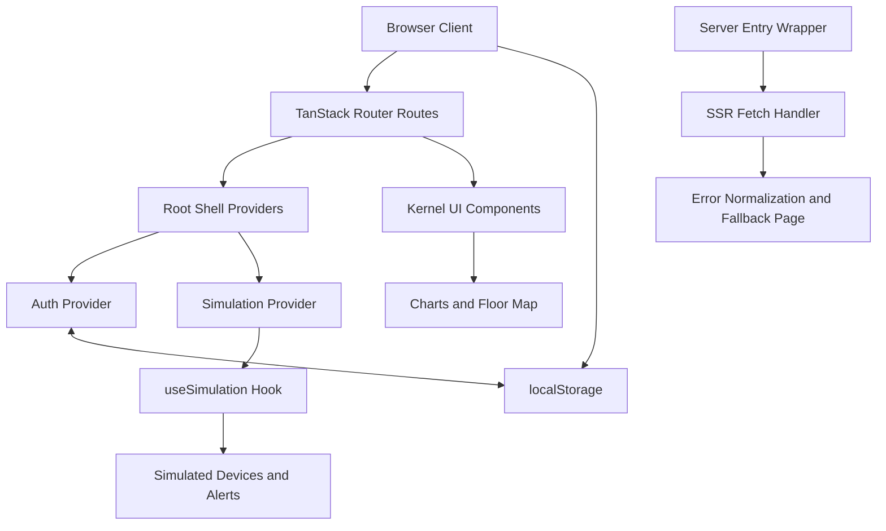

# Project Title

Kernel Smart Office Monitoring Dashboard

# Project Overview

Kernel is a frontend-focused smart office monitoring application built with React, TanStack Start, and TypeScript.
It provides a live digital twin style dashboard for office rooms and devices, including simulated power usage,
alerts, analytics, reporting export, and workspace settings.

The current implementation uses client-side state and simulated data only.

# Features

- Route-based dashboard application with authentication gate and login flow
- Live office device simulation with periodic updates
- Interactive floor map with room/device visualization and device toggling
- Device management page with search and filtering by room, type, and status
- Alerts page with severity filtering, acknowledge, and dismiss controls
- Analytics page with trend chart, room comparison, type breakdown, and top consumers
- Reports page with CSV export of current device inventory and metrics
- Settings page with profile fields and local preference persistence
- Light and dark theme toggle via settings
- Office hours indicator and alert context for outside-hour activity
- Global error boundary and server-side fallback error page handling

# Technologies Used

Frontend and Framework
- React 19
- TanStack Start
- TanStack Router
- TanStack React Query
- TypeScript
- Vite

Styling and UI
- Tailwind CSS v4
- Radix UI primitives
- Shadcn-style component structure
- Lucide React icons
- tw-animate-css

Data Visualization and Utilities
- Recharts
- React Hook Form
- Zod
- clsx
- tailwind-merge

Tooling
- ESLint
- Prettier
- Bun lockfile and Bun config present

# Folder Structure

```text
.
├─ public/
│  └─ favicon.ico
├─ src/
│  ├─ components/
│  │  ├─ kernel/            # Domain-specific dashboard components
│  │  └─ ui/                # Reusable UI primitives
│  ├─ hooks/                # Custom hooks (clock, simulation, animations, mobile)
│  ├─ lib/                  # Shared logic (auth, devices, simulation context, errors, utils)
│  ├─ routes/               # File-based pages and root shell
│  ├─ router.tsx            # Router creation
│  ├─ routeTree.gen.ts      # Auto-generated route tree
│  ├─ server.ts             # Server entry wrapper and SSR error normalization
│  ├─ start.ts              # TanStack Start instance and middleware
│  └─ styles.css            # Theme tokens and global styles
├─ components.json
├─ eslint.config.js
├─ package.json
├─ tsconfig.json
├─ vite.config.ts
└─ README.md
```

# System Architecture

Kernel follows a route-driven SPA/SSR-capable architecture using TanStack Start.

- Presentation layer: Route pages and kernel components
- State layer: Auth context and simulation context
- Data layer: Simulated in-memory device data with derived statistics
- Persistence: Browser localStorage for auth user and settings preferences
- Server wrapper: Request middleware and fallback error response path



# Installation

Prerequisites
- Node.js 20+ (recommended)
- npm or Bun

Install dependencies

With npm:
```bash
npm install
```

With Bun:
```bash
bun install
```

# Running the Frontend

Development server:
```bash
npm run dev
```

Production build:
```bash
npm run build
```

Preview production build:
```bash
npm run preview
```

Optional (development mode build):
```bash
npm run build:dev
```

# Backend Integration

Current status in this codebase:
- No business backend API integration is implemented
- No database integration is implemented
- No external data fetch pipeline for dashboard metrics is implemented

What exists server-side:
- A TanStack Start server entry wrapper is present for SSR error handling
- Error middleware and fallback HTML error response are implemented

Integration point guidance:
- Replace simulated state in the simulation hook/context with API-driven data sources
- Keep route/component contracts and progressively migrate per page

# Simulated Data

Simulated domain model currently includes:
- Rooms: Drawing Room, Work Room 1, Work Room 2
- Devices per room: 2 fans and 3 lights (15 devices total)
- Device fields: id, room, name, type, status, power draw, last change time, runtime

Simulation behavior:
- Runtime accumulates every second for active devices
- Occasional random device status flips are introduced
- Aggregate metrics are derived in-memory: total power, per-room power, active counts
- Alerts are generated from current state and office-hour rules

# Dashboard Features

Main dashboard includes:
- KPI cards for power, active devices, on devices, alerts, and estimated energy saved
- Interactive floor map with click-to-toggle devices and status tooltip
- Room-level status cards with per-room power
- Power gauge with per-room breakdown
- Alerts panel preview
- Office hours status card
- Energy trend and room comparison charts

Additional pages:
- Devices: filtering, search, per-device toggles, bulk turn-off for visible devices
- Alerts: severity tabs with acknowledge and dismiss interactions
- Analytics: trend, comparison, pie breakdown, and top runtime consumers
- Reports: CSV export snapshot of current device state
- Settings: local preferences and profile fields

# Future Improvements

- Replace simulated data with real backend API and persistent storage
- Introduce role-based authentication/authorization
- Persist alert actions (acknowledge and dismiss) across sessions
- Add automated tests (unit, integration, and E2E)
- Add telemetry and operational monitoring for production
- Add robust input validation and settings synchronization strategy
- Extend reporting with scheduled exports and historical data ranges

# Team Members

No team member information is currently defined in this repository.

Suggested format to add:
- Name - Role
- Name - Role

# Screenshots (placeholder)

Add screenshots here after UI capture.

Suggested assets:
- docs/screenshots/dashboard.png
- docs/screenshots/devices.png
- docs/screenshots/analytics.png
- docs/screenshots/alerts.png
- docs/screenshots/settings.png

# License

No LICENSE file is currently present in this repository.

If this project is intended for open-source use, add a LICENSE file (for example MIT, Apache-2.0, or GPL) and update this section accordingly.
